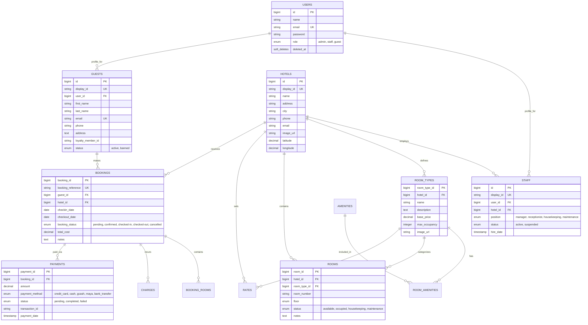

# 🗄️ Database Schema & Data Architecture

This document provides a comprehensive blueprint of the Inntera relational database, detailing every table, column, relationship, and constraint.

---

## 🗺️ Entity Relationship Diagram

---

## 📁 Detailed Table Definitions

### 🔐 01. Identity & Access
| Table | Description | Primary Key | Foreign Keys |
| :--- | :--- | :--- | :--- |
| `users` | The core authentication table for all users. | `id` | - |
| `guests` | Extended profiles for guest-role users. | `id` | `user_id` |
| `staff` | Operational profiles for staff-role users. | `id` | `user_id`, `hotel_id` |

### 🏨 02. Property Management
| Table | Description | Primary Key | Foreign Keys |
| :--- | :--- | :--- | :--- |
| `hotels` | Master record of hotel properties. | `id` | - |
| `room_types` | Definitions of room classes and base rates. | `room_type_id` | `hotel_id` |
| `rooms` | Individual physical room units. | `room_id` | `hotel_id`, `room_type_id` |
| `amenities` | Global list of room features. | `amenity_id` | - |
| `room_amenities`| Pivot linking types to amenities. | `id` | `room_type_id`, `amenity_id`|

### 📅 03. Reservation Engine
| Table | Description | Primary Key | Foreign Keys |
| :--- | :--- | :--- | :--- |
| `bookings` | The primary reservation ledger. | `booking_id` | `guest_id`, `hotel_id` |
| `booking_rooms` | Junction table for rooms in a booking. | `id` | `booking_id`, `room_id` |
| `rates` | Time-based pricing overrides. | `rate_id` | `room_type_id` |
| `payments` | Settlement records for bookings. | `payment_id` | `booking_id` |
| `charges` | Incidental costs (Food, Mini-bar). | `charge_id` | `booking_id` |

---

## 🛠️ Data Integrity Rules
- **Soft Deletes**: All major entities (`hotels`, `rooms`, `bookings`, `users`) utilize soft deletes to preserve audit trails.
- **Unique References**: Bookings generate a unique 8-character `booking_reference` for quick lookup in the Staff terminal.
- **Role Enforcement**: Access is strictly partitioned using the `role` column in the `users` table, synced with specific profile records in `staff` or `guests`.

---

  
<i>Inntera DB Blueprint v1.5 | Enterprise Schema Documentation</i>

